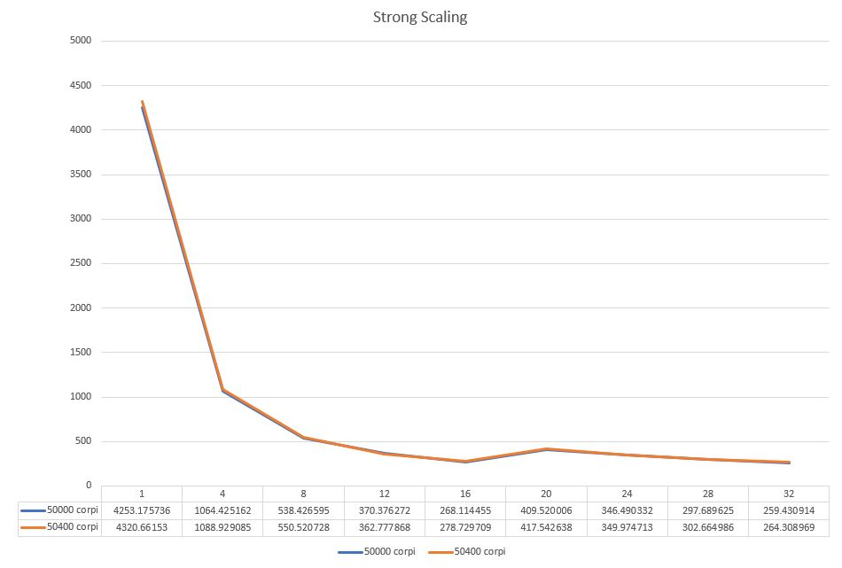
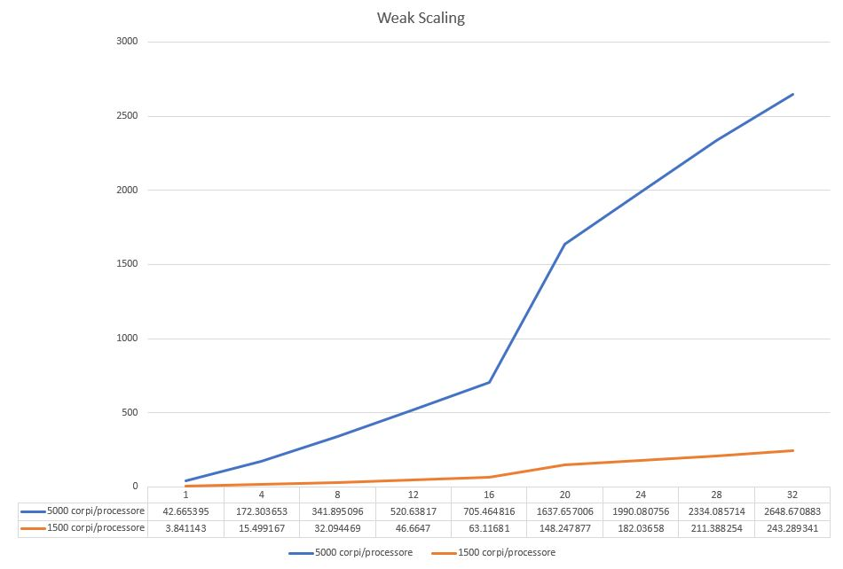

# N-body Simulation

***

## Programmazione Concorrente, Parallela e su Cloud
### Università degli Studi di Salerno
#### *Anno Accademico 2017/2018*

**Professore:** _Vittorio Scarano_
**Dottore:** _Carmine Spagnuolo_
**Studente:** _Carmine Vincenzo Russo_


---

## Problem Statement

In un problema n-body, abbiamo bisogno di trovare la posizione e la velocità di una collezione di corpi/particelle che interaggiscono in un periodo ti tempo.
Per esempio, un astrofisico potrebbe voler conoscere la posizione a la velocità di una collezione di stelle, mentre un chimico potrebbe voler conoscere la posizione e la velocità di una collezione di molecole o atomi.
Una soluzione n-body è prodotta da un programma che trova le soluzioni ad un prolema n-body simulando il comportamento dei corpi/particelle.
L'input del programma è il numero di corpi e il numero di iterazioni su cui effettuare le iterazioni. Sarà compito del programma generare in maniera pseudocasuale la posizione e la velocità di tutti i corpi richiesti dal numero di input in un ambiente tridimensinale. L'output del programma sarà il tempo totale utilizzato dal programma per eseguire la simulazione del problema n-body. 
Sono inoltre previsti due argomenti di input aggiuntivi: un flag di test e la frequenza di stampa, se il flag test è settato ad 1 verranno effettuate delle stempe di controllo per la divisione dei corpi sui processori e l'aggiornamento dei corpi all'interno dello spazio tridimensionale. Le stampe dei corpi verranno effettuate ogni X iterazioni della simulazione, dove X è la frequenza di stampa.

## Soluzione proposta

La soluzione proposta considera solo l'approccio n^2 rispetto al numero di corpi/particelle scelti. 
Sono state utilizzate funzioni __Scatter__ e __AllGather__ con l'aggiunta delle funzioni __send__ e __recv__ di **MPI** per realizzare un tipo di comunicazione Collective bloccante. 
I test sono stati effettuati sulle istanze di AWS **m4.xlarge**.

### Implementazione

Lo scopo del lavoro svolto è stato quello di parallelizzare il problema proposto partizionandolo in maniera equa su tutti i processori disponibili nel sistema.
Di seguito è descritto l'approccio utilizzato al fine di ottenere una distribuzione equa

```c
reminder= totBodies%worldSize;
chunk= totBodies/worldRank;
if (reminder== 0) {
	nBodies= chunk;
	bottomBody= worldRank* chunk;
	topBody= ((worldRank+1)* chunk)- 1;
} else if(reminder > 0 ) {
	if (worldRank < reminder) {
		nBodies= chunk+1;
		bottomBody= worldRank* chunk;
		topBody= ((worldRank+1)* chunk);
	} else if{
		nBodies= chunk;
		bottomBody= worldRank* chunk+ reminder;
		topBody= ((worldRank+1)* chunk)+ reminder- 1;
		}
}
```

Questo approccio ci permette di distribuire equamente il carico su tutti i processori evitando che ci siano processori più carichi di altri. Infatti assegiamo a tutti i processori lo stesso numero di corpi e se abbiamo corpi rimanenti (reminder) dopo questa assegnazione, questi li distribuiamo assegnando 1 corpo per processore fino a terminarli seguendo i rank assegnati ai processori stessi. 

I valori iniziali delle posizioni e delle velocità dei corpi vengono generati in maniera pseudocasuale. Il processo di generazione è suddiviso tra tutti i processori seguendo le partizioni prima calcolate dal bottomBody al topBody.

```c
void randomize() {
	int i;
	for(i = bottomBody; i<= topBody; i++) {
		bodies[i].x = 2.0f * (rand()/ (float)RAND_MAX) - 1.0f;
		bodies[i].y = 2.0f * (rand()/ (float)RAND_MAX) - 1.0f;
		bodies[i].z = 2.0f * (rand()/ (float)RAND_MAX) - 1.0f;
		bodies[i].vx = 2.0f * (rand()/ (float)RAND_MAX) - 1.0f;
		bodies[i].vy = 2.0f * (rand()/ (float)RAND_MAX) - 1.0f;
		bodies[i].vz = 2.0f * (rand()/ (float)RAND_MAX) - 1.0f;
	}
	if (reminder== 0) {
		MPI_Allgather(bodies+ bottomBody, nBodies, BodyMPI, bodies, nBodies, BodyMPI, MPI_COMM_WORLD);
	} else {
		falseGather();
	}

}
```

Conclusa l'iniziazializzazione dei corpi in ogni processore è necessario fare la propagazione dei corpi generati con tutti i processori che stanno partecipando alla risoluzione del problema. Nel caso di reminder uguale a zero è posibile utilizzare la funzione collettiva **AllGather** altrimenti utilizziamo la funzione _falseGather_ che è una simulazione dell'AllGather realizzata utilizzando **send** e **revc**.

Bisogna quindi calcolare le nuove posizioni e velocità dei corpi e successivamente aggiornare le posizioni. E' sempre necessario poi propagare tutte le nuove informazioni calcolate tramite **AllGather** o _falseGather_.

```c
void bodyForce() {
	int i, j;
	for(i= bottomBody; i<= topBody; i++) {
		float fx= 0.0f;
		float fy= 0.0f;
		float fz= 0.0f;
		for(j= 0; j< totBodies; j++) {
			float dx = bodies[j].x- bodies[i].x;
			float dy = bodies[j].y- bodies[i].y;
			float dz = bodies[j].z- bodies[i].z;
			float distSqr= dx* dx+ dy* dy+ dz* dz+ SOFTENING;
			float invDist= 1.0f/sqrtf(distSqr);
			float invDist3= invDist* invDist* invDist;

			fx+= dx* invDist3;
			fy+= dy* invDist3;
			fz+= dz* invDist3;
		}
		bodies[i].vx+= dt*fx;
		bodies[i].vy+= dt*fy;
		bodies[i].vz+= dt*fz;
	}
}

void updatePos() {
	int i; 
	for(i= bottomBody; i<= topBody; i++) {
		bodies[i].x+= bodies[i].vx*dt;
		bodies[i].y+= bodies[i].vy*dt;
		bodies[i].z+= bodies[i].vz*dt;
	}
}
```

La comunicazione che non sfrutta è le funzioni collettive è stato realizzato come segue:

```c
void falseGather() {
	int i;
	for(i= 0; i< worldSize; i++) {
		if(worldRank== i) {
			int j;
			for(j= 0; j< worldSize; j++) {
				if(j!= worldRank) {
					MPI_Send(bodies+ bottomBody, nBodies, BodyMPI, j, 1, MPI_COMM_WORLD);
					
				}
			}
		} else {
			int rec, start;
			if(i< reminder) {
				rec= chunk+1;
				start= rec*i; 
			} else {
				rec= chunk;
				start= rec* i+ reminder;i
			}
			MPI_Recv(bodies+ start, rec, BodyMPI, i, 1, MPI_COMM_WORLD, &status);

		}
	}
}
```

L'implementazione si basa sui parametri passati in input dall'utente.

```c
void getArgs(int argc, char **argv) {
	if( argc == 5) {
		totBodies= strtol(argv[1], NULL, 10);
		nIters= strtol(argv[2], NULL, 10);
		test= atoi(argv[3]);
		outputFreq= strtol(argv[3], NULL, 10);
		dt=0.1f;	
	} else if (argc==3) {
		totBodies= strtol(argv[1], NULL, 10);
		nIters= strtol(argv[2], NULL, 10);
		dt=0.1f;
	} else	{
		if(worldRank== 0) {
			printf("You must insert 2 arguments, 2 more are optionals: \n");
			printf("1-- Number of bodies;\n");
			printf("2-- Number of iterations;\n");
			printf("3-- OPTIONAL 1 if it's a test, status of processor and bodies will be printed\n");
			printf("4-- OPTIONAL Frequency of update about the simulation. Only with test=1\n");
		}
	}
	if( totBodies<= 0 || nIters<= 0) { //Checking the correctness of the arguments
		MPI_Finalize();
		exit(0);
	}
}
```

Il parametro _totBodies_ indica il numero totale di corpi su cui stiamo effettuando la simulazione, _nIters_ indica il numero totale di iterazioni. L'istante di tempo dt è fissato a 0.1 secondi, quindi tra un'iterazione e l'altra verrà considerata questa differenza di tempo. I due parametri aggiuntivi sono utilizzati per stampe di test. 
Il programma realizzato è stato compliato utilizzando il comando ``` mpicc nbody.c -nbody -lm``` è stato necessario utilizzare l'opzione __-lm__ per includere la libreria _math.h_. 

### Testing 

I test sono stati effettuati su delle istanze __m4.xlarge__ (4 core) d Amazon Web Service.
Durante la fase di testing sono stati tenuti in considerazione sia fattori di Strong scaling che di Weak scaling. 
Tutti i test sono stati effettuati 10 volte per avere dei valori più consistenti, per i risultati finali sono stati utilizzati i valori medi di tutti i tempi ottenuti per ogni caso di test. 
Tutti i tempi raccolti documentano il tempo di esecuzione della simulazione a partire dal momento successivo alla generazione dei corpi fino al termine della simulazione stessa. 
Inoltre i tempi dei test sono stati raccolti in secondi con 6 cifre decimali ma i grafi mostrati nelle sezioni successive mostrano i dati in numero di processori/millisecondi.  

Risorse massime utilizzate:

* 8 Istanze EC2 m4.xlarge **StarCluster-Ubuntu_12.04-x86_64-hvm** - _ami-52a0c53b_
* 32 processori (4 core per istanza)

Per i test il numero di iterazioni e l'istante di tempo sono stati fissati:
- Numero di iterazioni = 10;
- istante di tempo = 0.1;

Tutti i test sono stati quindi effettuati utilizzando il seguente comando 
```
mpirun -np X --hostfile hostlist nbody Y 10
```
Dove X indica il numero di processori (1, 4, 8, 12, 16, 20, 24, 28, 32) e Y indica il numerdo di corpi su cui effettuare la simulazione (50000, 1500*X, 5000*X).

## Strong Scaling

Lo Strong Scaling prevede un numero fissato di corpi con un incremento progressivo dei processori per testare la scalabilità. Nel nostro caso abbiamo effettuato due casi di test:
- 50400 corpi: Numero divisibile per tutti i valori di processori che abbiamo utilizzato, questo caso mostra i tempi quando solamente le funzioni collettive sono utilizzate
- 50000 corpi: Non tutti i test in questo caso utilizzano le funzioni collettive, ma si alternano tra funzioni collettive e funzioni point-to-point
Nella figura in basso è possibile osservare i risultati ottenuti durante questa fase di testing. 



Come è possibile notare i due casi hanno un andamento simile mostrando che non c'è differenzia sostanziale tra i casi che ricadono nelle funzioni collettive e quelli che ricadono nelle funzioni point-to-point.

## Weak Scaling

Il Weak Scaling prevede un numero fissato di corpi per ogni processore, quindi all'incremento dei processori incrementa proporzionalmente anche il numero di corpi utilizzati per il test.
Per il test sono stati effettuati due casi di test:
- 1500 corpi: Test con un carico basso
- 5000 corpi: Test con un carico alto
Nella figura in basso è possibile osservare i risultati ottenuti durante questa fase di testing.



## Fattori di efficienza della scalabilità

Di seguito vengono riportati i fattodi di efficienza della scalabilità ottenuti dai test effettuati.
Per lo Strong Scaling i fattori di scalabilità sono stati calcolati tramite la formula
```
t1/(N*tN)*100%
```
Per il Weak Scaling i fattori di scalabilità sono stati calcolati tramite la formula
```
(t1/tN)*100%
```
Con:
- t1: tempo di esecuzione utilizzando 1 processore
- N: numero di processori utilizzati per il caso corrente
- tN: tempo di esecuzione utilizzando N processori

I fattori di efficienza sono visualizzabili nella tabella seguente:

||4|8|12|16|20|24|28|32|
|--------|--------|--------|--------|--------|--------|--------|--------|--------|
|Strong Scaling 50400 corpi|0.9919|0.9810|0.9924|0.9688|0.5173|0.5144|0.5098|0.5108|
|Strong Scaling 50000 corpi|0.9989|0.9874|0.9569|0.9914|0.5192|0.5114|0.5102|0.5123|
|Weak Scaling 1500 corpi/proc|0.2478|0.1196|0.0823|0.0608|0.0259|0.0211|0.0181|0.01578|
|Weak Scaling 5000 corpi/proc|0.2476|0.1247|0.0819|0.0604|0.0260|0.0214|0.0182|0.01610|

___
___

##### Project Template

- strong: cartella contenente tutti i risultati dei test dello strong scaling, 50 casi con 50000 corpi e 504 casi con 50400 corpi. Contiene inoltre anche il grafico finale dei risultati ottenuti.
- weak: cartella contentente tutti i risultati dei test del weak scaling, 1500 casi con 1500 corpi/processore e 5000 casi con 5000 corpi/processori. Contiene inoltre anche il grafico finale dei risultati ottenuti.i
- data: contiene file di appoggio per l'elaborazione dei dati raccolti
- hostlist: hostfile per l'utilizzo del cluster durante il testing su AWS
- nbody: eseguibile del programma realizzato
- nbody.c: prodotto finale del progetto da noi svolto
